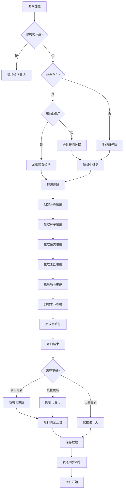
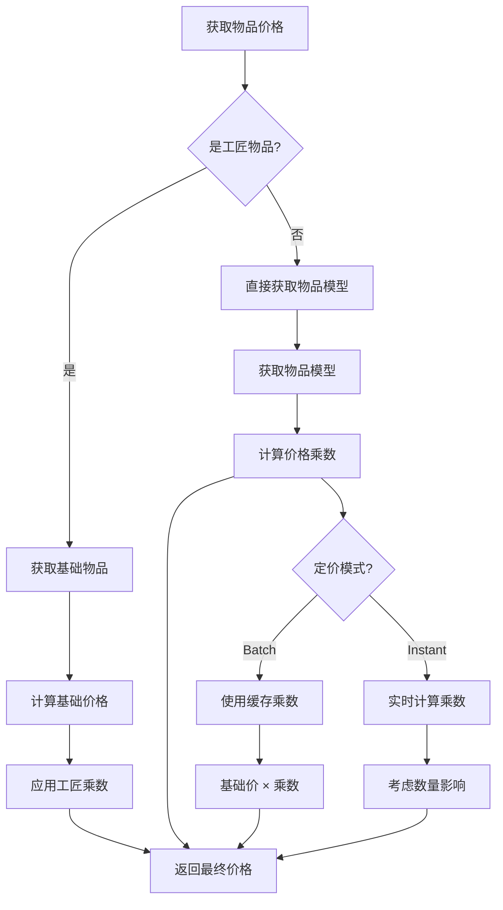
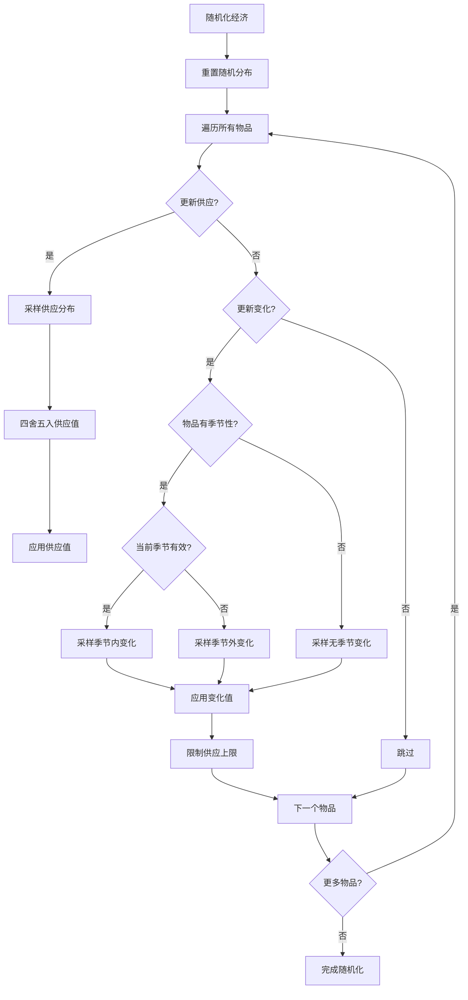

# Ferngill Simple Economy 算法分析

## 概述

Ferngill Simple Economy 是一个基于供需关系的动态经济系统，通过正态分布随机生成和实时调整机制，为Stardew Valley游戏提供动态价格变化。

## 核心算法组件

### 1. 供需模型 (Supply & Demand Model)

#### 数据结构
- **供应值 (Supply)**: 0 到 int.MaxValue，默认上限1000
- **每日变化 (DailyDelta)**: -30 到 30，每日自动调整供应
- **价格乘数 (Multiplier)**: 基于供应值动态计算

#### 核心逻辑
```csharp
// 供应值更新
Supply += DailyDelta;  // 每日自动调整

// 价格乘数计算 (ItemModel.GetMultiplier)
var ratio = 1 - (Math.Min(supply, MaxCalculatedSupply) / (decimal)MaxCalculatedSupply);
var percentageRange = MaxPercentage - MinPercentage;
return (ratio * percentageRange) + MinPercentage;
```

**价格乘数公式**：
```
Multiplier = (1 - Supply/MaxSupply) × (Max% - Min%) + Min%
```

**参数范围**：
- MinPercentage = 0.2 (最低20%价格)
- MaxPercentage = 1.3 (最高130%价格)
- MaxCalculatedSupply = 1000 (计算上限)

### 2. 正态分布采样系统

#### 分布参数配置
```csharp
// 供应分布: N(μ=500, σ=150)
Supply ~ Normal(500, 150)

// 每日变化分布: N(μ=0, σ=5)
Delta ~ Normal(0, 5)

// 季节内变化: N(μ=0, σ=12) 更大幅度
InSeasonDelta ~ Normal(0, 12)

// 季节外变化: N(μ=0, σ=5) 较小幅度
OutOfSeasonDelta ~ Normal(0, 5)
```

#### 采样实现
```csharp
public double SampleSupply() => _supplyNormal.Sample();
public double SampleSeasonlessDelta() => _deltaNormal.Sample();
public double SampleInSeasonDelta() => _inSeasonNormal.Sample();
public double SampleOutOfSeasonDelta() => _outOfSeasonNormal.Sample();
```

### 3. 价格计算算法

#### 单物品价格计算
```csharp
public decimal GetPrice(int basePrice, int quantity)
{
    var multiplier = ConfigModel.Instance.PricingMode switch
    {
        PricingMode.Batch => _cachedMultiplier,  // 批量模式：使用缓存乘数
        _ => GetMultiplier(Supply, quantity),     // 即时模式：实时计算
    };
    return basePrice * multiplier;
}
```

#### 批量价格计算 (考虑数量影响)
```csharp
private static decimal GetMultiplier(int supply, int quantity)
{
    if (supply > MaxCalculatedSupply) 
        return MinPercentage;  // 超过上限，最低价格
    
    if (quantity <= 1) 
        return GetMultiplier(supply);  // 单件，直接计算
    
    // 多件混合计算
    var endingSupply = supply + quantity - 1;
    var numberOfCappedItems = Math.Max(0, endingSupply - MaxCalculatedSupply);
    var numberOfVariableItems = quantity - numberOfCappedItems;
    
    // 线性插值计算平均乘数
    var variableMultiplier = (GetMultiplier(supply) + GetMultiplier(endingSupply)) / 2;
    var cappedMultiplier = MinPercentage;
    
    return ((variableMultiplier * numberOfVariableItems) + 
            (cappedMultiplier * numberOfCappedItems)) / quantity;
}
```

### 4. 季节性调整机制

#### 季节判断逻辑
```csharp
private bool ItemIsSeasonal(ItemModel model)
{
    // 检查种子季节
    var seed = GetSeedModelFromItem(model.ObjectId);
    if (seed != null && seed.Seasons != 0) return true;
    
    // 检查鱼类季节
    var fish = GetFishModelFromItem(model.ObjectId);
    if (fish != null && fish.Seasons != 0) return true;
    
    // 检查自定义季节映射
    return GetSeasonForItem(model.ObjectId) != AllSeasons;
}
```

#### 季节内/外变化差异
```csharp
item.DailyDelta = ItemValidForSeason(item, season)
    ? RoundDouble(normalDistributionService.SampleInSeasonDelta())  // 季节内：σ=12
    : RoundDouble(normalDistributionService.SampleOutOfSeasonDelta()); // 季节外：σ=5
```

### 5. 更新频率系统

#### 更新周期配置
```csharp
public enum UpdateFrequency
{
    Daily = 1,      // 每天更新
    Weekly = 7,     // 每周更新
    Seasonally = 28, // 每季节更新
    Yearly = 112,   // 每年更新
    Custom = -1     // 自定义天数
}
```

#### 更新触发逻辑
```csharp
public UpdateFrequencyModel GetUpdateFrequencyInformation(DayModel dayModel)
{
    var totalDays = dayModel.GetTotalDayCount();
    return new UpdateFrequencyModel
    (
        totalDays % GetSupplyUpdateFrequencyInDays() == 0,    // 供应更新
        totalDays % GetDeltaUpdateFrequencyInDays() == 0,     // 变化更新
        dayModel.DayOfMonth == (int)UpdateFrequency.Seasonally ? 
            SeasonHelper.GetNextSeason() : SeasonHelper.GetCurrentSeason()
    );
}
```

## 算法流程图

### 主经济循环流程


### 价格计算流程


### 供需随机化流程


## 关键算法特点

### 1. 基于正态分布的随机化
- 使用Math.NET Numerics实现高质量正态分布采样
- 供应值集中在500附近(μ=500, σ=150)
- 变化值集中在0附近(μ=0, σ=5-12)

### 2. 线性价格乘数
- 价格乘数与供应值呈线性反比关系
- 供应越高，价格越低(最低20%)
- 供应越低，价格越高(最高130%)

### 3. 季节性动态调整
- 季节内物品变化幅度更大(σ=12)
- 季节外物品变化幅度较小(σ=5)
- 鼓励玩家种植当季作物

### 4. 批量定价支持
- Batch模式：全天价格锁定，适合大批量销售
- Instant模式：实时计算，考虑销售数量影响
- 支持混合计算多件物品的平均价格

### 5. 数据持久化与同步
- 经济状态保存到存档文件
- 多人游戏自动同步
- 支持动态添加新物品

## 配置参数影响

### 价格范围控制
- `MinPercentage`: 最低价格百分比 (默认0.2)
- `MaxPercentage`: 最高价格百分比 (默认1.3)
- `MaxCalculatedSupply`: 供应计算上限 (默认1000)

### 随机性控制
- `StdDevSupply`: 供应分布标准差 (默认150)
- `StdDevDelta`: 变化分布标准差 (默认5)
- `StdDevDeltaInSeason`: 季节内变化标准差 (默认12)
- `StdDevDeltaOutOfSeason`: 季节外变化标准差 (默认5)

### 更新频率控制
- `SupplyUpdateFrequency`: 供应更新周期
- `DeltaUpdateFrequency`: 变化更新周期
- 支持每日、每周、每季、每年或自定义天数

## 算法优势

1. **数学基础扎实**: 基于正态分布，符合真实市场波动
2. **性能高效**: 线性计算，缓存优化，支持批量处理
3. **灵活配置**: 几乎所有参数都可调整
4. **季节感强**: 不同季节有明显的价格波动差异
5. **兼容性好**: 自动支持模组添加的新物品
6. **多人支持**: 完整的同步机制

## 算法局限性

1. **线性模型**: 价格乘数线性变化，可能不够真实
2. **无历史影响**: 只考虑当前供应，不考虑历史趋势
3. **独立物品**: 物品间无相互影响(如替代品效应)
4. **固定范围**: 价格百分比范围固定，极端情况处理有限