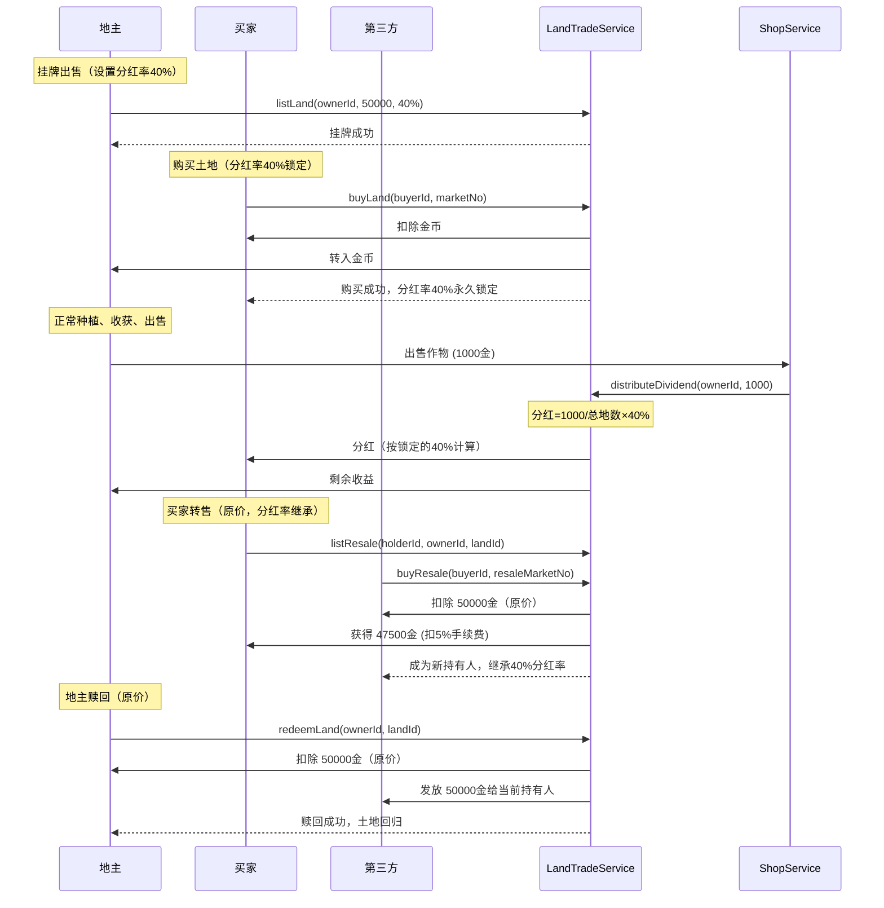

# 土地收益权买卖系统设计文档

> **版本**: 3.8.1
> **创建日期**: 2025-12-26
> **状态**: 设计完成

---

## 1. 核心规则

```
┌─────────────┐     ┌─────────────┐     ┌─────────────┐
│   出售土地   │ ──→ │    分红     │ ──→ │   地主赎回   │
│ (地主挂牌卖) │     │ (出售作物时) │     │ (地主发起)   │
└─────────────┘     └─────────────┘     └─────────────┘
                          │
                          ↓
                    ┌─────────────┐
                    │   买家转售   │
                    │ (卖给第三方) │
                    └─────────────┘
```

### 1.1 一句话规则

> **地主可以出售土地收益给别人来融资，土地产出卖钱时买家拿分红，地主可以赎回土地，买家也可以转卖。**

---

## 2. 核心约束

| 规则 | 说明 |
|------|------|
| **整块买卖** | 一块地一块地卖，不拆分份额 |
| **价格自定** | 买卖价格由地主自行决定 |
| **分红率自定** | 地主挂牌时设置“地块分红率”（20%-50%），成交后锁定（按出售总收益计算，但按“总地数均分到每块地”后再乘该地块分红率，避免超发） |
| **赎回权** | 地主可发起赎回，买家可以转售 |
| **分红时机** | 土地作物**出售时**触发分红 |
| **分红计算** | 出售总收益先按地主**总土地数**均分到每块地，再乘该地块锁定的“地块分红率”发给当前持有人 |

---

## 3. 四步流程

### Step 1: 出售土地

```
地主操作：#出售土地 <价格> [分红率%]
示例：#出售土地 50000 40
含义：挂牌出售 1 块土地的收益权，售价 5 万金币，分红率 40%（地块由系统自动选择）
```

| 要素 | 说明 |
|------|------|
| **谁卖** | 土地地主 |
| **卖什么** | 土地收益权（经营权仍归地主） |
| **价格** | 地主自定 |
| **分红率** | 地主自定（20%-50%），成交后锁定；若不填则使用 `config.dividend.default_rate` |
| **限制** | 土地处于自持状态，且未挂牌/未售出 |

**系统自动选地规则（建议约束）**：
- 从该地主 `status=owned` 的地块中，按 `Player.lands[].id` 升序选择第一块
- 挂牌成功后回包需同时展示：`挂牌ID(listingId)`、`landId`、价格、分红率

**买家操作：**
```
#购买土地 <市场序号>
示例：#购买土地 1
含义：购买“土地市场”中序号为 1 的挂牌
```

### Step 2: 分红

```
分红时机：地主出售作物时
```

| 要素 | 说明 |
|------|------|
| **触发时机** | 地主出售作物时 |
| **分红比例** | 地块分红率 `dividendRate` 由地主设置（20%-50%）且成交后锁定 |
| **分红计算** | 出售总收益按地主总土地数均分到每块地，再乘该地块锁定的 `dividendRate` |

**分红公式：**
```
每块地基础分红 = 出售收益 / 地主总土地数
买家实际分红（单块）= 每块地基础分红 × 地块分红率(dividendRate)
买家实际分红（合计）= Σ(买家持有的每块已售地块的实际分红)

等价写法（单块）：
买家实际分红 = 出售收益 / 地主总土地数 × dividendRate
```

**示例：**
```
地主张三有 10 块地：
  - 卖了 3 块给 A（锁定分红率 50%）
  - 卖了 2 块给 B（锁定分红率 30%）

张三出售作物获得 1000 金：

  每块地基础分红 = 1000 / 10 = 100 金

  A 分红 = 100 × 50% × 3 = 150 金
  B 分红 = 100 × 30% × 2 = 60 金
  张三得 = 1000 - 210 = 790 金
```

**扩张影响分析：**
```
张三扩张到 20 块地，产出也翻倍至 2000 金：

  每块地基础分红 = 2000 / 20 = 100 金（不变）

  A 分红 = 100 × 50% × 3 = 150 金（不变）
  B 分红 = 100 × 30% × 2 = 60 金（不变）

结论：产出与土地等比例增长时，买家分红不变（无稀释）
```

### Step 3: 地主赎回

```
地主操作：#赎回土地 1
含义：赎回"我的售出"列表中序号1的土地
```

| 要素 | 说明 |
|------|------|
| **谁发起** | 地主发起 |
| **赎回价格** | 原价（无溢价） |
| **买家获得** | 原价（期间分红已实时发放） |

### Step 4: 买家转售

```
买家操作：#转售土地 <持有序号>
示例：#转售土地 1
含义：把“我的持有”列表中序号1的土地挂牌转售（固定原价）
```

| 要素 | 说明 |
|------|------|
| **谁发起** | 当前持有人（买家） |
| **卖给谁** | 第三方玩家（非地主） |
| **价格** | 固定原价（不可自定） |
| **转售后** | 新买家继承分红权，地主赎回时付给新买家 |

---

## 4. 待讨论事项

### 4.1 分红比例 ✅ 已确定

**方案**：地主自定义分红率，成交后锁定

```
每块地基础分红 = 出售收益 / 地主总土地数
买家实际分红（单块）= 每块地基础分红 × 地块分红率(dividendRate)
买家实际分红（合计）= Σ(买家持有的每块已售地块的实际分红)
```

| 规则 | 说明 |
|------|------|
| **分红率范围** | 20% - 50%（防止极端值） |
| **设置时机** | 挂牌出售时设置 |
| **锁定规则** | 成交后永久锁定，不受后续调整影响 |
| **转售继承** | 转售时分红率保持不变，新买家继承 |

**设计优点**：
- 地主可通过高分红率吸引买家、提高售价
- 买家投资预期明确，成交即锁定
- 后续调整不影响已成交交易，保障双方权益

### 4.2 赎回与转售价格 ✅ 已确定

**方案**：原价赎回、原价转售，买家无权拒绝

```
赎回价格 = 原价
转售价格 = 原价（固定）
```

| 规则 | 说明 |
|------|------|
| **赎回价格** | 原价（无溢价） |
| **转售价格** | 原价（固定，不可自定） |
| **买家权限** | 无权拒绝赎回 |
| **赎回时机** | 地主随时可发起 |

**设计理由**：
- 规则极简：买多少卖多少，赎回也是原价
- 收益来源单一：买家纯靠分红，无投机空间
- 地主动力：不赎回则持续分红，赎回可止损

### 4.3 其他问题 ✅ 已确定

| 问题 | 结论 |
|------|------|
| 转售时地主有优先购买权？ | 无，直接交易 |
| 转售手续费？ | 5% |
| 地主不活跃怎么办？ | 不处理（买家自担风险） |
| 手续费去向？ | 进入系统资金池（销毁或归公共账户，避免玩家间转移引发套利） |

---

## 5. 数据模型

### 5.1 土地扩展字段

```javascript
// Player.lands[] 每块土地新增
{
  id: 3,
  crop: null,
  quality: 'red',
  // ... 现有字段 ...

  // === 买卖系统 ===
  trade: {
    status: 'owned' | 'listed' | 'sold',  // 自持/挂牌中/已售出

    // 挂牌信息（status=listed时有效）
    listing: {
      id: 'L_9f3a2c',         // 挂牌ID（市场展示/购买使用）
      price: 50000,           // 挂牌价格
      dividendRate: 40,       // 锁定分红率（20 ~ 50）
      listTime: 170349...     // 挂牌时间
    },

    // 售出信息（status=sold时有效）
    sold: {
      holderId: 'user123',    // 当前持有人ID
      price: 50000,           // 初始成交价格（赎回基准）
      dividendRate: 40,       // 分红率（成交后永久锁定）
      soldTime: 170349...,    // 初始成交时间
      totalDividend: 8000,    // 累计已发分红

      // 转售挂牌信息（持有人挂牌转售时有效）
      resale: {
        isListed: false,      // 是否挂牌转售中
        id: 'R_a81c10',        // 转售挂牌ID（isListed=true 时有效）
        // 转售价格固定为 sold.price（原价），无需单独存储，避免不一致
        listTime: 170349...   // 挂牌时间
      }
    }
  }
}
```

---

## 6. 服务设计

### 6.1 LandTradeService

**文件**: `services/player/LandTradeService.js`

```javascript
class LandTradeService {

  // ========== 出售 ==========

  /**
   * 挂牌出售土地
   */
  async listLand(ownerId, price, dividendRate) {
    // 1. 从 status=owned 的地块中自动选择一块（如按 landId 升序取第一块）
    // 2. dividendRate 可选：未传则使用 config.dividend.default_rate
    // 2. 检查土地状态
    // 3. 设置挂牌信息
  }

  /**
   * 取消挂牌
   */
  async cancelListing(ownerId, marketNo) {
    // 1. 通过“我的挂牌 marketNo”定位到 listingId -> landId
    // 2. 校验归属与状态后取消
  }

  /**
   * 购买土地
   */
  async buyLand(buyerId, marketNo) {
    // 1. 通过 marketNo(市场序号) 定位到 listingId -> ownerId+landId
    // 2. 验证挂牌状态
    // 2. 扣除买家金币
    // 3. 转给地主
    // 4. 更新土地状态为 sold
    // 5. 记录买家索引
  }

  // ========== 分红 ==========

  /**
   * 发放分红（地主出售作物时调用，一次结算覆盖该地主所有已售出地块）
   */
  async distributeDividend(ownerId, saleAmount) {
    // 1. 计算每块地基础分红 = saleAmount / 地主总土地数
    // 3. 遍历该地主所有 status=sold 的地块，按锁定 dividendRate 发放给当前 holderId
    // 4. 处理舍入与尾差（见“边界与实现细节”）
  }

  // ========== 赎回 ==========

  /**
   * 地主赎回土地
   */
  async redeemLand(ownerId, landId) {
    // 1. 检查土地状态
    // 2. 计算赎回价格
    // 3. 扣除地主金币
    // 4. 发放给买家
    // 5. 清空售出信息
  }

  // ========== 转售 ==========

  /**
   * 买家挂牌转售
   */
  async listResale(holderId, ownerId, landId) {
    // 1. 验证持有关系
    // 2. 设置转售挂牌
  }

  /**
   * 取消转售挂牌
   */
  async cancelResale(holderId, holdingNo) {
    // 1. 通过“我的持有 holdingNo”定位到 ownerId+landId
    // 2. 校验当前持有人与转售状态后取消
  }

  /**
   * 第三方购买转售土地
   */
  async buyResale(buyerId, resaleMarketNo) {
    // 1. 通过 resaleMarketNo(转售市场序号) 定位到 resaleListingId -> ownerId+landId
    // 2. 验证转售状态
    // 2. 扣除买家金币
    // 3. 扣除手续费
    // 4. 转给原持有人
    // 5. 更新持有人为新买家
  }

  // ========== 查询 ==========

  async getMarketListings() { ... }
  async getMyListings(userId) { ... }
  async getMyHoldings(userId) { ... }
  async getMySoldLands(userId) { ... }
}
```

---

## 7. 用户指令

| 指令 | 角色 | 说明 |
|------|------|------|
| `#出售土地 <价格> [分红率%]` | 地主 | 挂牌出售（系统自动选地）；分红率不填则走默认值，填写时范围20-50 |
| `#取消出售 <市场序号>` | 地主 | 按“我的挂牌”序号取消挂牌 |
| `#土地市场` | 全员 | 查看挂牌列表（含市场序号、分红率、价格） |
| `#购买土地 <市场序号>` | 买家 | 按“土地市场”序号购买，锁定分红率 |
| `#我的挂牌` | 地主 | 查看自己当前挂牌列表（带序号） |
| `#我的持有` | 买家 | 查看持有列表（带序号） |
| `#我的售出` | 地主 | 查看售出列表（带序号） |
| `#赎回土地 <序号>` | 地主 | 按"我的售出"序号赎回 |
| `#转售土地 <序号>` | 持有人 | 按"我的持有"序号挂牌转售 |
| `#取消转售 <序号>` | 持有人 | 按"我的持有"序号取消转售 |
| `#转售市场` | 全员 | 查看转售挂牌列表（含市场序号） |
| `#购买转售 <市场序号>` | 第三方 | 按“转售市场”序号购买（固定原价） |

---

## 8. 配置

```yaml
# config/default_config/land_trade.yaml
#
# 说明：当前为设计占位。实现落地时可选择新增该文件，或合并进现有配置文件（如 `config/default_config/market.yaml`）。

# 分红
dividend:
  min_rate: 20              # 地块分红率下限（挂牌时设置，作用于“每块地基础分红”）
  max_rate: 50              # 地块分红率上限（挂牌时设置，作用于“每块地基础分红”）
  default_rate: 30          # 默认地块分红率（#出售土地 未填写分红率时使用）

# 转售
resale:
  fee_rate: 0.05            # 转售手续费 5%
```

---

## 9. 边界与实现细节（建议落地约束）

### 9.1 标识与序号

- 交互层使用“市场序号/列表序号”更省输入；存储与交易定位仍应使用稳定的 `挂牌ID/转售挂牌ID`
- 为降低“列表刷新导致误买”的风险：展示时回显 `市场序号 + 挂牌ID(可隐藏)`，成交/取消等关键回包需回显 `挂牌ID + landId`
- “我的持有/我的售出/我的挂牌”的序号仅用于交互；服务层应将序号解析为稳定ID后再执行扣款/状态变更
- 序号生成建议：按 `listTime` 升序排列；同时间以 `listingId` 升序作为稳定兜底；执行购买/取消时若序号越界则提示刷新列表

### 9.2 并发与一致性

- `buyLand / redeemLand / listResale / buyResale` 需对同一 `(ownerId, landId)` 做互斥（锁/事务/乐观锁版本号均可），保证“扣款 + 状态变更 + 资金转移”原子性
- 任何一步失败必须回滚或补偿，避免出现“扣钱成功但状态未变/重复卖出”等问题

### 9.3 分红结算口径与舍入

- `saleAmount` 口径建议取“本次卖作物的最终结算收入”（以 Shop/结算服务为准），避免重复扣费
- 金币为整数时建议：对每个持有人分红做 `floor` 取整；尾差留给地主（保证发放总额不超过按公式计算的应发总额）

---

## 10. 流程图



---

## 11. 讨论记录

| 日期 | 讨论内容 | 结论 |
|------|----------|------|
| 2025-12-25 | 初始设计 | 整块买卖，地主赎回 |
| 2025-12-25 | 分红计算 | 按总土地数均分×地块分红率，防稀释 |
| 2025-12-25 | 保底土地 | 不需要，地主始终拿大头 |
| 2025-12-25 | 赎回价格 | 原价赎回，无溢价，买家无权拒绝 |
| 2025-12-25 | 买家转售 | 允许，原价转售，收 5% 手续费 |
| 2025-12-25 | 分红率自定义 | 地主可设置20%-50%，成交后锁定 |
| 2025-12-25 | 扩张与分红 | 产出等比增长时无稀释 |

---

## 变更记录

| 日期 | 版本 | 变更内容 |
|------|------|----------|
| 2025-12-25 | 1.0 | 初始复杂设计（份额制） |
| 2025-12-25 | 2.0 | 简化为购买→分红→赎回 |
| 2025-12-25 | 3.0 | 改为整块买卖，地主赎回 |
| 2025-12-25 | 3.1 | 新增买家转售功能 |
| 2025-12-25 | 3.2 | 分红按总土地数分配，移除保底限制 |
| 2025-12-25 | 3.3 | 分红率改为地主自定义（20%-50%），成交后锁定 |
| 2025-12-26 | 3.4 | 赎回价格确定为原价×1.2，买家无权拒绝 |
| 2025-12-26 | 3.5 | 简化：赎回原价、转售原价，移除所有溢价 |
| 2025-12-26 | 3.6 | 确定其他问题：无优先购买权、5%手续费、不处理不活跃 |
| 2025-12-26 | 3.7 | 统一挂牌ID/接口签名，修正文档不一致并补齐边界约束 |
| 2025-12-26 | 3.7.1 | 出售不再指定地块：系统自动选地；取消出售改为按挂牌ID |
| 2025-12-26 | 3.7.2 | 交互改为市场序号：购买/取消/转售购买均按序号输入，稳定ID仅内部使用 |
| 2025-12-26 | 3.7.3 | 澄清 base_rate 与 default_rate 口径：前者为分红池比例，后者为地块分红率默认值（后续已在 3.8.0 移除 base_rate） |
| 2025-12-26 | 3.8.0 | 移除系统基础分红池：分红率直接按“出售总收益/总地数”计算 |
| 2025-12-26 | 3.8.1 | 一致性清理：补齐取消转售接口，修正旧“20%/分红池”残留文案，补充序号生成建议与配置占位说明 |
