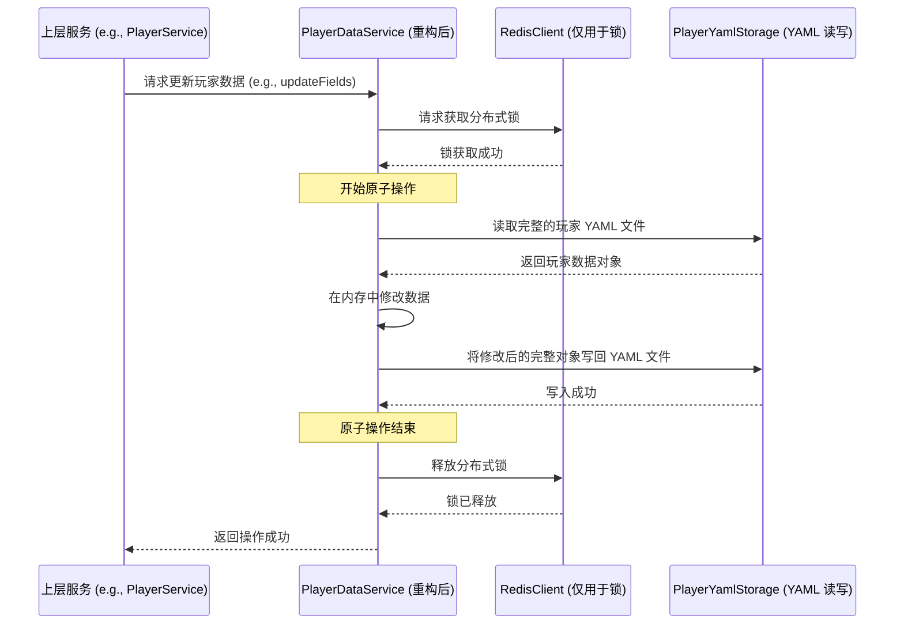

# 存储系统重构方案

## 1. 背景与目标

根据 `redis_simplification_proposal.md` 中确立的架构方向，我们决定对现有的玩家数据存储系统进行重构。

**核心目标**:
- **统一数据源**: 将所有核心玩家数据统一存储到 YAML 文件中，使其成为唯一、权威的数据源。
- **简化架构**: 彻底移除当前 Redis 与 YAML 的混合存储模型，降低系统复杂性。
- **提升健壮性**: 引入分布式锁机制，确保并发操作下的数据原子性和一致性。
- **明确 Redis 定位**: 将 Redis 的角色重新定位为轻量级的“协调与状态管理器”，仅保留分布式锁、临时状态（TTL）和原子计数器三大核心功能。

## 2. 详细重构步骤

| 步骤 | 任务 | 描述 |
|---|---|---|
| 1 | **改造 PlayerDataService** | 移除混合存储逻辑，使其完全依赖 `playerYamlStorage` 进行数据持久化。所有数据更新将遵循“读取-修改-写入”的原子模式。 |
| 2 | **引入分布式锁** | 在所有执行“读取-修改-写入”操作的方法外层包裹 `redisClient.withLock`，确保整个过程的原子性。 |
| 3 | **简化 PlayerSerializer** | 废弃为 Redis Hash 存储定制的序列化方法，创建更通用的 `serialize` 和 `deserialize` 方法。 |
| 4 | **审阅并重构依赖服务** | 审查所有直接依赖 `PlayerDataService` 的上层服务（主要在 `services/player/` 目录下），确保它们能正确调用新的、更简洁的 API。 |
| 5 | **整合并简化 Redis 工具类** | 将所有 Redis 相关功能（客户端初始化、分布式锁、TTL、原子计数器）整合到一个新的、统一的文件中（例如 `utils/redis.js`），并彻底移除 `redisClient.js redislock.js`。 |
| 6 | **清理冗余代码** | 移除 `PlayerDataService` 中与字段分类相关的代码，以及其他因重构而不再需要的代码。 |
| 7 | **保障文件写入原子性** | 所有文件写入操作必须遵循“**写入临时文件后重命名**”的模式，以防止在写入过程中因意外（如断电）导致文件损坏。 |
| 8 | **制定并执行测试计划** | 编写单元测试、集成测试，并进行完整的手动回归测试，确保重构质量和功能的完整性。 |
| 9 | **更新项目文档** | 更新架构图、数据流说明以及代码注释，确保文档与最终实现保持一致。 |

## 3. 影响范围分析

本次重构的核心影响范围被严格控制在 `services/player/` 目录下的各个服务。通过保持 `PlayerDataService` 对外接口的稳定性，上层服务基本不受底层存储逻辑变化的直接影响。

**受影响的主要文件**:
- `services/player/PlayerService.js`
- `services/player/EconomyService.js`
- `services/player/LandManagerService.js`
- `services/player/PlayerStatsService.js`
- `services/player/SignInService.js`
- `services/player/ShopService.js`
- `services/player/ProtectionService.js`

## 4. 重构后数据流

## 5. 关键决策的论证

### 5.1. 性能权衡分析

- **性能影响**: 经分析，新方案下每次写操作的总耗时约为 **6-15 毫秒**（包含锁开销和文件 I/O）。
- **结论**: 相较于纯 Redis 操作（约 1-3 毫秒），我们接受这约 5-10 毫秒的性能开销。这是因为在项目当前阶段，**架构的简单性、数据的一致性和开发的迭代速度**远比微秒级的性能优化更重要。

### 5.2. 分布式锁的安全性

- **实现**: 我们将依赖 `redisClient.js` 中已有的 `withLock` 方法。
- **风险规避**:
    - **死锁**: 该方法通过为每个锁设置 TTL（自动过期时间），从根本上避免了死锁风险。
    - **锁误释放**: 通过在释放锁时使用 Lua 脚本验证锁的唯一值，确保了只有锁的持有者才能释放锁，避免了因业务超时等原因导致的锁被错误释放的问题。

### 5.3. Redis 核心功能保留的理由

- **分布式锁**: 保障“读取-修改-写入”文件操作的原子性，是数据一致性的基石。
- **带自动过期的临时状态 (TTL)**: 用于干净、无污染地管理冷却时间、保护期等临时状态，是业务逻辑简洁性的关键。
- **原子计数器**: 用于高效、正确地实现每日次数限制等功能，是特定场景下的最佳实践。

## 6. 结论

此方案旨在通过统一数据源和简化核心服务，彻底解决现有架构的数据一致性风险，同时大幅提升系统的可维护性和健壮性。这是一个符合项目当前阶段核心利益的战略性重构。