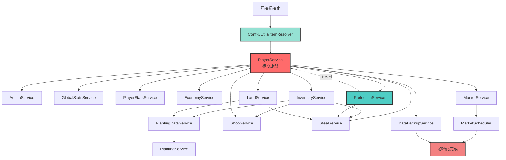
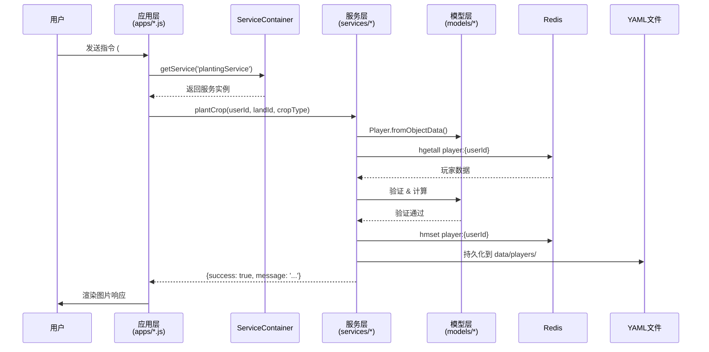

# Farm Game - 项目总索引

> 农场游戏插件 - 基于 Miao-Yunzai 框架的完整农场经营系统
>
> **版本**: 2.0+
> **架构**: Service-Oriented + Dependency Injection
> **存储**: Redis (热数据) + YAML (持久化)
> **渲染**: Puppeteer + Vue.js

---

## 📋 项目概览

### 核心特性
- 🌱 **种植系统**: 多种作物、实时生长、护理机制 (浇水/施肥/除虫)
- 💰 **经济系统**: 动态市场、买卖交易、金币奖励
- 🐶 **社交玩法**: 偷菜机制、防护系统 (狗粮)、好友农场访问
- 📊 **成长系统**: 玩家等级、经验值、签到奖励
- 🏡 **土地系统**: 土地扩张、品质升级 (普通/红/黑/金)

### 技术栈
- **语言**: JavaScript (ES6+)
- **框架**: Miao-Yunzai (QQ Bot Framework)
- **数据库**: Redis 6.0+
- **配置**: YAML
- **渲染**: Puppeteer + Vue.js
- **工具**: Lodash, Chokidar (文件监听)

---

## 🏗️ 项目结构

```
farm_game/
├── index.js                    # 🚪 插件入口 (动态加载应用层)
├── PROJECT_INDEX.md            # 📖 本文件 (项目总索引)
│
├── apps/                       # 🎮 应用指令处理层
│   ├── FOLDER_INDEX.md         # 应用层索引文档
│   ├── farm.js                 # 农场核心操作 (#种植/#收获)
│   ├── player.js               # 玩家系统 (#注册/#签到)
│   ├── shop.js                 # 商店交易 (#商店/#购买/#出售)
│   ├── inventory.js            # 仓库管理 (#仓库/#仓库升级)
│   ├── steal.js                # 偷菜系统 (#偷菜/#狗粮)
│   ├── land_management.js      # 土地管理 (#土地扩张/#土地升级)
│   ├── admin.js                # 管理员工具
│   ├── help.js                 # 帮助文档
│   └── update.js               # 更新通知
│
├── services/                   # 🔧 业务服务层
│   ├── FOLDER_INDEX.md         # 服务层索引文档
│   ├── index.js                # ⭐ ServiceContainer (依赖注入核心)
│   ├── player/                 # 玩家子系统
│   │   ├── PlayerService.js            # 玩家核心服务 (门面)
│   │   ├── PlayerDataService.js        # 数据访问层 (Redis+YAML)
│   │   ├── PlayerSerializer.js         # 序列化器
│   │   ├── SignInService.js            # 签到服务
│   │   ├── LevelCalculator.js          # 等级计算
│   │   ├── EconomyService.js           # 经济系统
│   │   ├── InventoryService.js         # 仓库管理
│   │   ├── LandService.js              # 土地操作
│   │   ├── ProtectionService.js        # 防护系统
│   │   ├── StealService.js             # 偷菜逻辑
│   │   ├── ShopService.js              # 商店交易
│   │   └── PlayerStatsService.js       # 统计服务
│   ├── planting/               # 种植子系统
│   │   ├── PlantingService.js          # 种植服务门面
│   │   ├── PlantingDataService.js      # 种植数据层
│   │   ├── CropPlantingService.js      # 作物种植
│   │   ├── CropHarvestService.js       # 作物收获
│   │   ├── CropCareService.js          # 作物护理
│   │   ├── CropMonitorService.js       # 作物监控
│   │   ├── PlantingUtils.js            # 种植工具
│   │   └── PlantingMessageBuilder.js   # 消息构建
│   ├── market/                 # 市场子系统
│   │   ├── MarketService.js            # 市场服务门面
│   │   ├── MarketDataManager.js        # 市场数据管理
│   │   ├── PriceCalculator.js          # 价格计算
│   │   ├── TransactionManager.js       # 交易管理
│   │   ├── MarketScheduler.js          # 定时任务调度
│   │   └── taskScheduler.js            # 任务调度器
│   ├── admin/                  # 管理子系统
│   │   ├── AdminService.js             # 管理员服务
│   │   └── GlobalStatsService.js       # 全局统计
│   └── system/                 # 系统子系统
│       └── DataBackupService.js        # 数据备份服务
│
├── models/                     # 📦 数据模型层
│   ├── FOLDER_INDEX.md         # 模型层索引文档
│   ├── Player.js               # 玩家数据模型
│   ├── Land.js                 # 土地数据模型
│   ├── Item.js                 # 物品数据模型
│   ├── Config.js               # 配置管理器 (YAML热加载)
│   ├── Data.js                 # 数据工具
│   ├── constants.js            # 项目常量
│   ├── services.js             # 服务聚合导出
│   └── puppeteer.js            # 图片渲染引擎
│
├── utils/                      # 🛠️ 工具类层
│   ├── FOLDER_INDEX.md         # 工具类索引文档
│   ├── ItemResolver.js         # 物品解析器 (名称→ID)
│   ├── CommonUtils.js          # 通用工具集 (时间/随机/数组/对象)
│   ├── calculator.js           # 计算工具 (经验/价格/统计)
│   ├── redisClient.js          # Redis客户端单例
│   ├── fileStorage.js          # 文件存储抽象 (YAML/JSON)
│   └── playerYamlStorage.js    # 玩家YAML存储
│
├── config/                     # ⚙️ 配置文件
│   ├── config/                 # 用户自定义配置 (可覆盖)
│   │   ├── crops.yaml          # 作物配置
│   │   ├── items.yaml          # 物品配置
│   │   ├── land.yaml           # 土地配置
│   │   ├── levels.yaml         # 等级配置
│   │   ├── market.yaml         # 市场配置
│   │   └── steal.yaml          # 偷菜配置
│   └── default_config/         # 默认配置 (系统提供)
│       └── ...                 # (同上)
│
├── resources/                  # 🎨 前端资源
│   ├── farm/                   # 农场界面 (Vue组件)
│   ├── shop/                   # 商店界面
│   ├── inventory/              # 仓库界面
│   ├── signin/                 # 签到界面
│   └── common/                 # 公共资源 (CSS/JS库)
│
├── data/                       # 💾 运行时数据
│   ├── players/                # 玩家数据 (YAML持久化)
│   ├── market/                 # 市场数据 (JSON)
│   └── backups/                # 数据备份
│
├── Docs/                       # 📚 文档
│   ├── README.md               # 项目简介
│   ├── architecture.md         # 架构设计文档
│   ├── developer-guide.md      # 开发者指南
│   ├── user-guide.md           # 用户指南
│   └── api-reference.md        # API 参考
│
└── temp/                       # 🗑️ 临时文件 (开发过程产物)
```

---

## 🗺️ 架构导航图

### 分层架构视图
```
┌─────────────────────────────────────────────────────────┐
│                     Entry Point                          │
│                     index.js                             │
│          (动态加载应用层 + 初始化服务容器)                  │
└─────────────────────────────────────────────────────────┘
                           ↓
┌─────────────────────────────────────────────────────────┐
│                   Application Layer                      │
│                     apps/*.js                            │
│       (指令解析 → 参数验证 → 调用服务 → 渲染响应)           │
│                                                          │
│  farm.js │ player.js │ shop.js │ inventory.js │ ...    │
└─────────────────────────────────────────────────────────┘
                           ↓
┌─────────────────────────────────────────────────────────┐
│                    Service Layer                         │
│                   services/index.js                      │
│              (ServiceContainer - 依赖注入容器)            │
│                                                          │
│  ┌─────────────────────────────────────────────────┐   │
│  │  PlayerService │ PlantingService │ MarketService│   │
│  │  ShopService │ InventoryService │ StealService  │   │
│  └─────────────────────────────────────────────────┘   │
│                 (业务逻辑 + 事务管理)                     │
└─────────────────────────────────────────────────────────┘
                           ↓
┌─────────────────────────────────────────────────────────┐
│                     Model Layer                          │
│                     models/*.js                          │
│    (数据结构 → 验证逻辑 → 序列化 → 业务方法)                │
│                                                          │
│      Player │ Land │ Item │ Config                      │
└─────────────────────────────────────────────────────────┘
                           ↓
┌─────────────────────────────────────────────────────────┐
│                   Storage Layer                          │
│        Redis (高频热数据) + YAML (持久化冷数据)            │
└─────────────────────────────────────────────────────────┘
```

---

## 🔗 核心依赖关系图

### ServiceContainer 初始化流程 (拓扑排序)


### 数据流动图


---

## 📂 文件夹详细索引

| 文件夹 | 索引文档 | 文件数 | 主要职责 |
|--------|----------|--------|---------|
| **apps/** | [FOLDER_INDEX.md](./apps/FOLDER_INDEX.md) | 9 | 指令处理、参数验证、响应渲染 |
| **services/** | [FOLDER_INDEX.md](./services/FOLDER_INDEX.md) | 30+ | 业务逻辑、数据操作、事务管理 |
| **models/** | [FOLDER_INDEX.md](./models/FOLDER_INDEX.md) | 8 | 数据模型、验证、序列化 |
| **utils/** | [FOLDER_INDEX.md](./utils/FOLDER_INDEX.md) | 6 | 工具函数、计算、存储抽象 |
| **config/** | - | 6×2 | YAML配置文件 (作物/物品/土地/等级/市场/偷菜) |
| **resources/** | - | 多个 | Vue组件、CSS、图片资源 |
| **Docs/** | - | 5 | 项目文档、架构设计、开发指南 |

---

## 🚀 快速开始

### 1. 导航到核心文件

**入口文件**:
- [index.js](./index.js:1) - 插件入口,动态加载应用层

**核心服务**:
- [services/index.js](./services/index.js:1) - ServiceContainer (依赖注入核心)
- [services/player/PlayerService.js](./services/player/PlayerService.js:1) - 玩家服务门面
- [services/planting/PlantingService.js](./services/planting/PlantingService.js:1) - 种植服务门面

**核心模型**:
- [models/Player.js](./models/Player.js:1) - 玩家数据模型
- [models/Config.js](./models/Config.js:1) - 配置管理器

**核心应用**:
- [apps/farm.js](./apps/farm.js:1) - 农场核心操作
- [apps/player.js](./apps/player.js:1) - 玩家基础功能

### 2. 理解数据流

```
用户指令 (#种植小麦1)
  ↓
apps/farm.js (指令解析)
  ↓
serviceContainer.getService('plantingService')
  ↓
PlantingService.plantCrop(userId, landId, cropType)
  ↓
PlayerDataService.getPlayer(userId) → Redis/YAML
  ↓
InventoryService.removeItem(userId, 'wheat_seed', 1)
  ↓
LandService.updateLand(userId, landId, cropData)
  ↓
PlantingService 返回结果
  ↓
apps/farm.js 渲染图片
  ↓
用户接收响应
```

### 3. 添加新功能

#### 示例: 添加新指令 "查看作物详情"

1. **创建应用处理器** (apps/crop_details.js):
```javascript
import serviceContainer from '../services/index.js';

export class CropDetailsApp extends plugin {
  constructor() {
    super({
      name: '作物详情',
      rule: [{ reg: '^#作物详情(\\d+)$', fnc: 'showCropDetails' }]
    });
    this.plantingService = serviceContainer.getService('plantingService');
  }

  async showCropDetails(e) {
    const landId = parseInt(e.msg.match(/\d+/)[0]);
    // 调用服务层...
  }
}
```

2. **扩展服务层** (services/planting/PlantingService.js):
```javascript
async getCropDetails(userId, landId) {
  // 业务逻辑...
  return { success: true, data: {...} };
}
```

3. **自动加载**: index.js 会自动扫描并加载 apps/ 下的新文件

### 4. 修改配置

配置文件位于 `config/config/*.yaml`,修改后会自动热更新 (chokidar监听):
```yaml
# config/config/crops.yaml
wheat:
  name: 小麦
  price: 50
  growTime: 180  # 秒
  experience: 10
  icon: icon-wheat
```

---

## 🎯 设计模式总结

| 模式 | 应用位置 | 作用 |
|------|---------|------|
| **依赖注入** | ServiceContainer | 解耦服务依赖,统一管理生命周期 |
| **门面模式** | PlayerService, PlantingService | 简化复杂子系统的接口 |
| **单例模式** | Config, redisClient | 全局唯一实例 |
| **工厂模式** | Player.createEmpty() | 标准化对象创建 |
| **策略模式** | ItemResolver | 不同物品分类的解析策略 |
| **观察者模式** | Config (chokidar) | 配置文件变更监听 |
| **DAO模式** | PlayerDataService | 数据访问抽象 |

---

## 📊 项目统计

- **总代码文件**: 66 个 JavaScript 文件
- **核心服务**: 15+ 个业务服务
- **应用指令**: 9 个应用模块
- **数据模型**: 4 个核心模型 (Player, Land, Item, Config)
- **工具类**: 6 个工具类
- **配置文件**: 6 类 YAML 配置
- **代码行数**: 约 15,000+ 行 (不含注释)

---

## 🔍 相关文档

- [README.md](./README.md) - 项目简介和安装指南
- [Docs/architecture.md](./Docs/architecture.md) - 详细架构设计文档
- [Docs/developer-guide.md](./Docs/developer-guide.md) - 开发者指南
- [Docs/user-guide.md](./Docs/user-guide.md) - 用户使用指南

---

## 📝 维护日志

### 索引系统初始化
- **日期**: 2025-12-22
- **工具**: project-multilevel-index
- **内容**:
  - ✅ 生成 PROJECT_INDEX.md (项目总索引)
  - ✅ 生成 apps/FOLDER_INDEX.md (应用层索引)
  - ✅ 生成 services/FOLDER_INDEX.md (服务层索引)
  - ✅ 生成 models/FOLDER_INDEX.md (模型层索引)
  - ✅ 生成 utils/FOLDER_INDEX.md (工具层索引)
  - ✅ 为核心文件添加 Input/Output/Pos 注释头
  - ✅ 创建 Mermaid 依赖关系图

### 下一步
- 📋 为剩余文件批量生成文件头注释
- 📋 根据代码变更自动更新索引 (使用 `/update-index`)
- 📋 定期检查索引一致性 (使用 `/check-index`)

---

**🎉 索引系统初始化完成!** 现在您可以通过本文档快速导航整个项目。
