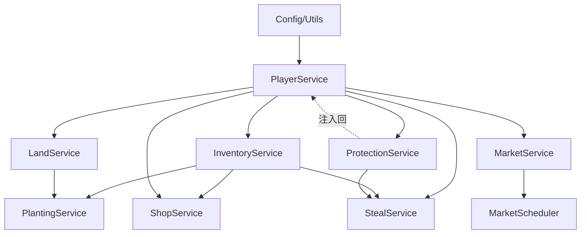

# services/ - 业务服务层

## 📁 文件夹概述

**位置**: `/services`
**角色**: 业务逻辑层 (Business Logic Layer)
**职责**: 封装业务逻辑 → 数据操作 → 事务管理 → 状态维护

## 📂 子文件夹结构

```
services/
├── index.js                    # ServiceContainer 容器 (依赖注入核心)
├── player/                     # 玩家子系统
│   ├── PlayerService.js        # 玩家核心服务 (门面)
│   ├── PlayerDataService.js    # 数据访问层
│   ├── PlayerSerializer.js     # 序列化器
│   ├── SignInService.js        # 签到服务
│   ├── LevelCalculator.js      # 等级计算
│   ├── EconomyService.js       # 经济系统
│   ├── InventoryService.js     # 仓库管理
│   ├── LandService.js          # 土地操作
│   ├── LandTradeService.js     # 土地收益权交易
│   ├── ProtectionService.js    # 防护系统
│   ├── StealService.js         # 偷菜逻辑
│   ├── ShopService.js          # 商店交易
│   └── PlayerStatsService.js   # 统计服务
├── planting/                   # 种植子系统
│   ├── PlantingService.js      # 种植服务门面
│   ├── PlantingDataService.js  # 种植数据层
│   ├── CropPlantingService.js  # 作物种植
│   ├── CropHarvestService.js   # 作物收获
│   ├── CropCareService.js      # 作物护理
│   ├── CropMonitorService.js   # 作物监控
│   ├── PlantingUtils.js        # 种植工具
│   └── PlantingMessageBuilder.js # 消息构建
├── market/                     # 市场子系统
│   ├── MarketService.js        # 市场服务门面
│   ├── MarketDataManager.js    # 市场数据管理
│   ├── PriceCalculator.js      # 价格计算
│   ├── TransactionManager.js   # 交易管理
│   ├── MarketScheduler.js      # 定时任务调度
│   └── taskScheduler.js        # 任务调度器
├── admin/                      # 管理子系统
│   ├── AdminService.js         # 管理员服务
│   └── GlobalStatsService.js   # 全局统计
└── system/                     # 系统子系统
    └── DataBackupService.js    # 数据备份

```

## 🎯 核心服务注册表

| 服务名 | 类 | 职责 | 依赖 |
|--------|-----|------|------|
| `playerService` | PlayerService | 玩家核心管理 | PlayerDataService, EconomyService, SignInService |
| `plantingService` | PlantingService | 种植生命周期 | PlantingDataService, InventoryService, LandService |
| `inventoryService` | InventoryService | 仓库物品管理 | PlayerDataService, EconomyService |
| `shopService` | ShopService | 商店交易 | InventoryService, PlayerService, LandTradeService |
| `landTradeService` | LandTradeService | 土地收益权交易 | PlayerService, EconomyService, FileStorage |
| `marketService` | MarketService | 市场价格系统 | PriceCalculator, MarketDataManager, TransactionManager |
| `stealService` | StealService | 偷菜逻辑 | PlayerService, InventoryService, ProtectionService |
| `protectionService` | ProtectionService | 防护系统 | PlayerService |
| `landService` | LandService | 土地操作 | PlayerService |
| `economyService` | EconomyService | 经济系统 | - |
| `adminService` | AdminService | 管理功能 | PlayerService |

## 🔗 依赖关系图 (拓扑排序)



## 🏗️ 架构模式

### 1. 依赖注入容器 (ServiceContainer)
- **单例模式**: 全局唯一的服务容器实例
- **工厂模式**: `getService(name)` 获取服务
- **生命周期管理**: `init()` 初始化, `shutdown()` 优雅关闭

### 2. 门面模式 (Facade)
- **PlayerService**: 聚合玩家相关的所有子服务
- **PlantingService**: 聚合种植相关的所有子服务
- **MarketService**: 聚合市场相关的所有子服务

### 3. 数据访问层 (DAO)
- **PlayerDataService**: 玩家数据的 Redis + YAML 混合存储
- **PlantingDataService**: 种植数据的专门访问层

### 4. 事务管理
- **LandService**: 提供土地操作的事务支持
- **PlayerDataService**: `executeWithTransaction()` 原子操作

## 🔄 服务初始化顺序

```javascript
// ServiceContainer.init() 执行顺序 (解决循环依赖)
1. Config, CommonUtils, ItemResolver       // 基础工具
2. PlayerService                           // 核心依赖
3. AdminService, GlobalStatsService        // 独立服务
4. EconomyService, PlayerStatsService      // 辅助服务
5. InventoryService, LandService           // 依赖 PlayerService
6. PlantingDataService, PlantingService    // 依赖多个服务
7. ShopService                             // 依赖 Inventory + Player
8. ProtectionService → 注入回 PlayerService // 解决循环依赖
9. StealService                            // 依赖多个服务
10. MarketService, MarketScheduler         // 市场子系统
11. DataBackupService                      // 数据备份
```

## 📐 设计原则

### 单一职责原则 (SRP)
- 每个服务专注于单一业务领域
- 数据访问与业务逻辑分离

### 依赖倒置原则 (DIP)
- 应用层依赖服务抽象,而非具体实现
- 通过容器注入,降低耦合

### 开闭原则 (OCP)
- 通过继承和组合扩展功能
- 避免修改已有服务代码

## 🔍 服务使用示例

### 基础用法
```javascript
// 在应用层获取服务
import serviceContainer from '../services/index.js';

class MyApp extends plugin {
  _initServices() {
    this.playerService = serviceContainer.getService('playerService');
    this.plantingService = serviceContainer.getService('plantingService');
  }

  async handleCommand(e) {
    const player = await this.playerService.getPlayer(userId);
    const result = await this.plantingService.plantCrop(userId, landId, cropType);
  }
}
```

### 事务操作
```javascript
// 使用事务确保数据一致性
await playerService.dataService.executeWithTransaction(userId, async (dataService, userId) => {
  player.coins -= 100;
  await dataService.savePlayer(userId, player);
  await inventoryService.addItem(userId, 'wheat_seed', 10);
});
```

## 🛡️ 错误处理

- 所有服务方法返回标准格式: `{ success: boolean, message: string, data: any }`
- 使用 `try-catch` 捕获异常并记录日志
- 数据验证失败返回用户友好的错误消息

## 📊 性能优化

- Redis 缓存热数据
- 批量操作减少 I/O 次数
- 延迟加载 (Lazy Loading) 避免循环依赖

## 🔍 相关文档

- [应用层文档](../apps/FOLDER_INDEX.md)
- [数据模型文档](../models/FOLDER_INDEX.md)
- [工具类文档](../utils/FOLDER_INDEX.md)
- [项目架构文档](../Docs/architecture.md)
